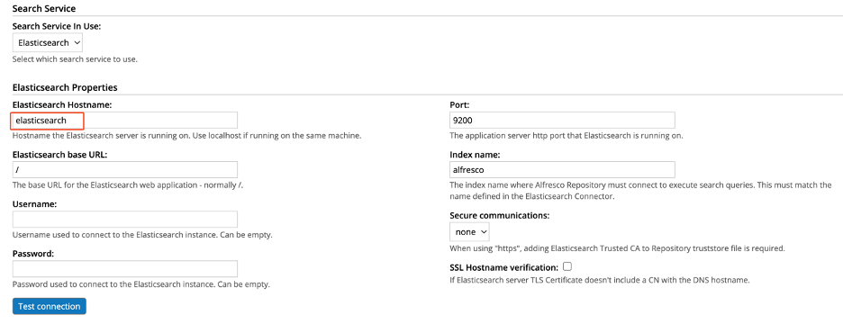

# Configure ACS to use Elasticsearch rather than Solr

This guide is a condensed version of the official Alfresco documentation to [Install using JAR files](https://docs.alfresco.com/search-enterprise/latest/install/#install-using-jar-files) geared to the Alfresco Demo Platform running on an AWS EC2. The information here was used to install and configure Alfreseco Content Services (ACS) 7.4.0 distributed in the ADP version 7.4.1 with the Alfresco Search Enterprise (ASE) 3.3.1.

Accoding to the release notes for ASE 3.3.x, ACS 7.4.0 is the minimum supported *(contrary to the documentation site's Supported Platforms).*

*Note: These instructions will run the connector as a standalone application on the EC2, **not** in a container supported by the `adp.py` script! In other words, proceed at your own risk and make a backup image of your system, **just in case**.*

## EC2 Prep Work

1. Acquire the ASE software.

    You can request it through Hyland Community's link to [Tech Support](https://community.hyland.com/products/alfresco/release-notes/release-notes/alfresco-search-enterprise-331).

1. Log into your EC2. You can `ssh` or connect via VS Code if you've set it up. Refer to [VS Code with Remote SSH](../VS%20Code%20with%20Remote%20SSH/) for more information.

1. Install java on your EC2. From a command line,

    `sudo yum install java-11-amazon-corretto.x86_64`

1. Create a directory for the ASE jar files.

    `mkdir ~/adp/elastic-connector-331`

1. Upload the ASE jar files to the new directory.

1. Download [model-ns-prefix-mapping-1.0.0](https://github.com/AlfrescoLabs/model-ns-prefix-mapping/releases/download/1.0.0/model-ns-prefix-mapping-1.0.0.jar) and upload it to your EC2

    or

    From a command line on your EC2 `wget https://github.com/AlfrescoLabs/model-ns-prefix-mapping/releases/download/1.0.0/model-ns-prefix-mapping-1.0.0.jar`

1. Deploy the `model-ns-prefix-mapping-1.0.0.jar` extention to the ADP Content container like other ACS AMPs/JARs. Place it in `~/adp/data/services/content/custom`.

1. Edit the alfresco-global.properties file and add the lines similar to the documentation for Elasticsearch at <https://docs.alfresco.com/search-enterprise/latest/install/#configure-subsystem-in-repository>, but note the `elasticsearch.host` change. **On the internal Docker container network in the ADP, the Elasticsearch container has a host name of `elasticsearch`.** Inside the content container, `localhost` would refer to the content container.

    ***NOTE:*** You'll also need to comment out the existing `index.subsystem.name=solr6`.

    ```properties
    #index.subsystem.name=solr6
    
    # Set the Elasticsearch subsystem
    index.subsystem.name=elasticsearch
    # Elasticsearch index properties
    elasticsearch.indexName=alfresco
    elasticsearch.createIndexIfNotExists=true
    # Elasticsearch server properties
    elasticsearch.host=elasticsearch
    elasticsearch.port=9200
    elasticsearch.baseUrl=/
    ```

1. Restart the ADP instance. It may be overkill, but this is a custom setup with regards to the ASE documentation.

    `./adp.py stop; ./adp.py start`

## Configure the ASE Connector

1. From a command line on the EC2 instance, change directory into the `elastic-connector-331` location.

    `cd ~/adp/elastic-connector-331`

1. Get the namespace (ns) prefix map. You need a valid username / password. This will create the file `reindex.prefixes-file.json` for use in the next step.

    `curl -u `*`<acs-username>:<acs-password>`*` http://localhost:80/alfresco/s/model/ns-prefix-map > reindex.prefixes-file.json`

1. On the EC2 open the Repository Admin Web Console

    `http://`*`<ec2-hostname>`*`/alfresco/s/enterprise/admin`

1. Open the Search Service screen and set it to Elasticsearch and change the hostname from `localhost` to `elasticsearch`, if necessary. From the content conainer's point of view, Elasaticsearch is running in the elasticsearch container, whose internal docker network hostname is `elasticsearch`.

    

1. Save the change. You can also click the Test connection button after refreshing the browser.

1. In the elastic-connector-331 directory run the reindex.

    ```bash
    java -jar alfresco-elasticsearch-reindexing-3.3.1-app.jar \
    --alfresco.reindex.jobName=reindexByIds \
    --spring.elasticsearch.rest.uris=http://localhost:9200 \
    --spring.datasource.url=jdbc:postgresql://localhost:5432/alfresco \
    --spring.datasource.username=alfresco \
    --spring.datasource.password=alfresco \
    --alfresco.reindex.prefixes-file=file:reindex.prefixes-file.json \
    --alfresco.acceptedContentMediaTypesCache.baseurl=http://localhost:8090/transform/config \
    --spring.activemq.broker-url=nio://localhost:61616
    ```

    *In this case, the `localhost:9200` is valid (see the hostname comment above for the Search Service configuration) since the command is running at the docker host system (EC2) level where Elasticsearch's container is accessible on the localhost, port 9200.*

## Start Live Indexing

To start the live-indexing program, in an EC2 terminal window, change directory to  `elastic-connector-331`
and run it in the background as below to keep it running if the terminal session ends.

*That's all on one line below!*

```bash
nohup java -jar alfresco-elasticsearch-live-indexing-3.3.1-app.jar --spring.activemq.broker-url=nio://localhost:61616 --spring.elasticsearch.rest.uris=http://localhost:9200 --alfresco.sharedFileStore.baseUrl=http://localhost:8099/alfresco/api/-default-/private/sfs/versions/1/file/ --alfresco.acceptedContentMediaTypesCache.baseurl=http://localhost:8090/transform/config --elasticsearch.indexName=alfresco > live-index.log 2> live-index-error.log &
```

To make life easier, upload the [start-live-index.sh](./start-live-index.sh) script to your adp directory. Then from a command prompt run the command `chmod ug+x` to make it an executable. Then you just need to run the script to start live indexing.

`./start-live-index.sh`

The process will log errors to `live-index-error.log` and regular output to `live-index.log`.

To see it running (or to get the PID to kill it for restart):

`ps -ef |grep ec2-user|grep live-indexinging`

*The first number in the java command is the PID. In the sample below, **48770**.* 

```bash
ec2-user   48770   11860 15 20:53 pts/0    00:00:17 java -jar alfresco-elasticsearch-live-indexing-3.3.1-app.jar --spring.activemq.broker-url=nio://localhost:61616 --spring.elasticsearch.rest.uris=http://localhost:9200 --alfresco.sharedFileStore.baseUrl=http://localhost:8099/alfresco/api/-default-/private/sfs/versions/1/file/ --alfresco.acceptedContentMediaTypesCache.baseurl=http://localhost:8090/transform/config --elasticsearch.indexName=alfresco
ec2-user   49592   11860  0 20:55 pts/0    00:00:00 grep --color=auto live-index
```

Then to stop the live indexing process,

`kill -9 48770`

### Troubleshooting

* During testing and getting the sequence of steps right, sometimes the content container would fail to finish starting. For whatever reason, I could repair the problem by deleting the content container, **but not its data volume(s).**

    `./adp.py stop`

    `./adp.py destroy content`

    `./adp.py start`
