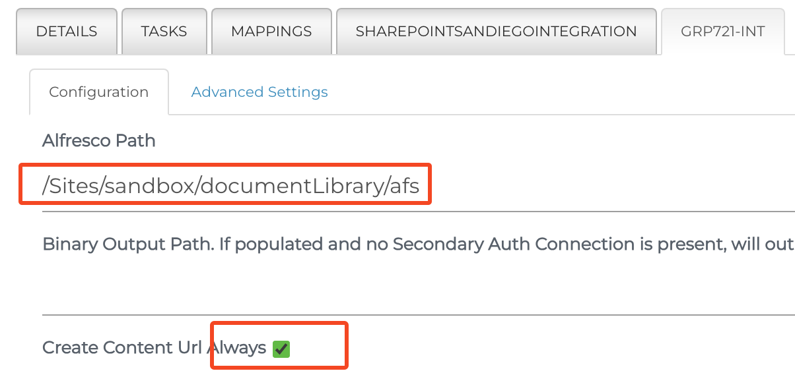

# AFS Server Setup / Config with ADP

The following sections detail information to 

1. Deploy an Alfresco Federation Services (AFS) Server on a standalone instance with the ***ADP 7.4.1 distribution.***

1. Configure Transparent Content Services (TCS) on an Alfresco Content Services (ACS) ADP instance.

1. Configure a SharePoint to Alfresco Manage-in-Place (MIP) federation job.

## Deploy AFS Server

When you spin up a new ADP 7.4.1 instance, it is a fully functional ACS/ADP system. The AFS Server components should run on a different system. This means you need to un-deploy the running containers and reconfigure ADP.

1. Open a shell / terminal on your ADP machine.

    ```shell
    ./adp.py stop
    ./adp.py destroy all -f
    ```

1. Edit the `config.json` file in the `adp` directory. Change the services array in the local section to contain only nginx, afs, and dozzle (for logs access).

    ```json
    "local": {
        ...
        "services": [
            "nginx",
            "afs",
            "dozzle"
        ],
        "deployed_modules": []
    },

    ```

1. Edit the `nginx.conf` file in the `data/services/nginx` directory. Comment out or remove the `location /admin/` entry.

    ```conf
    # location /admin/ {
    #     proxy_pass http://control-center:8080/;
    #     absolute_redirect off;
    # }
    ```

1. Edit `docker-compose.yml` and comment out the volumes related to ADW in the `nginx` service section.

    ```yml
    nginx:
        image: 047614345379.dkr.ecr.us-east-1.amazonaws.com/adp/nginx:7.4.1
        #mem_limit: 128m
        ports:
            - "80:80"
        volumes:
            - ./data/:/data/
            # Root directory of the compiled ADW app
            # - ./data/services/nginx/html/digital-workspace/:/usr/share/nginx/html/digital-workspace/
            # Nginx configuration exposed to the host
            - ./data/services/nginx/nginx.conf:/etc/nginx/nginx.conf
            # ADW configuration exposed to the host
            # - ./data/services/nginx/html/digital-workspace/app.config.json:/usr/share/nginx/html/digital-workspace/app.config.json
            # ADW extension config for AI service
            # - ./data/services/nginx/html/digital-workspace/assets/app.extensions.json:/usr/share/nginx/html/digital-workspace/assets/app.extensions.json
    ```

1. Start up the new configuration. The new 

    ```shell
    ./adp.py start
    ```

    Once the adp.py script starts polling for ACS (`Waiting for ACS to be ready...`)to start you can type \<Ctrl\>-C to stop.

1. Log into the AFS Admin application

    `http://<AFS ADP Server>/federation`

    Under the Admin Section of the left side menu, click Licenses and then paste the license key and click add. *You'll need the key string in later steps.*

     

    

## Deploy and Configure TCS to ACS and Share

There are two jar file extensions to deploy; one to the content container and one to the share container. You can either download them from Hyland Community or follow the steps below to extract them from ADP's controller container.

### Extract the TCS files directly from the ADP files

Open a terminal window and ssh to ACS instance. From the adp folder run the following two commands.

```shell
docker-compose exec -T controller 'bash -c "cp /repo_modules/transparent-content*.jar /data/services/content/custom/"'
docker-compose exec -T controller 'bash -c "cp /share_modules/transparent-content*.jar /data/services/share/custom/"'
```

### Download from Hyland Community

Download the AFS 2.1 distribution zip `2.1-Alfresco-Assets-AFS.zip` and unzip it in a local directory. From the `Alfresco 7.x\TCS` folder you will need:

- `transparent-content-services-platform7-3.1.2.jar`
- `transparent-content-services-share7-3.1.2.jar`

Copy the platform7 jar to the ADP images `data/services/content/custom` folder. Then copy the share7 jar to `data/services/share/custom`

### Update alfresco-global.properties for TCS

Edit the `alfresco-global.properties` in the `data/services/content` directory. Add the lines below and fill in values in \< ... \> as appropriate. *While you're in there, make sure any other entries that start with `adp` or `batchapi` are either removed or commented out.*

```properties
tcs.user=admin
tcs.pass=<admin password>
tcs.url=http://<AFS ADP Server>/federation
tcs.licensekey=<add the AFS key string here>
tcs.connectorIds=<these will be source repo connection IDs>
tcs.defaultStoreName=DefaultStoreName

batchapi.jsonthreadcount=20
batchapi.batchthreadcount=50
batchapi.userid=demo
batchapi.rules.disableall=false
batchapi.licensekey=<add the AFS key string here>
```

## Configure a SharePoint to Alfresco Manage-in-Place Job

Before you start setting up a Hyland SharePoint connection, you will likely need to get a SharePoint Application ID created. This requirement also means you need to enable SSL on your AFS ADP instance (or any ADP instance for that matter).

### Prep work

#### Add SSL to AFS ADP

The ADP has the ability to enable SSL / HTTPS on your ADP EC2 host. This is a pre-requisite for the OAUTH configuration for the SharePoint APP ID. It will ask a series of questions and then build the AWS artifacts.

From a terminal session on your ADP instance, run the following. You'll need to know the instance id `i-nnnnnnnnnnnn`. You can get that from the AWS EC2 console or by running `./adp.py aws ec2 list`. It will also prompt for the ec2 public dns name (hostname). **Make sure you use static vanity name and NOT the IP generated `ec2-nn-nn-nn-nn...amazonaws.com` name.** 

`./adp.py aws ec2 ssl`

After you answer all the questions the script will generate all the AWS artifacts. After a few minutes the process will complete and the details are stored in the aws section of the config.json.

#### Get SharePoint APP ID for your Site

Open an ISWO to have the your ID created. You will need to provide the SharePoint site information as well as the SSL URL for the AFS server. (`https://<subdomain>.alfdemo.com`). You can provide the Simflofy reference page as part of the ticket. [Setting up SharePoint APP ID](https://docs.simflofy.com/connections/simflofy-connectors/sharepoint-rest). They'll be create the SharePoint REST Azure AD Connector APP ID.

 The SharePoint admins will do the Azure configuration and provide you back with the following information.

| Name | Value |
| --- | ---|
| Client Id   |  \<client id string\> |
|Client Secret |  \<Client Secret String\>|
|Title |         Simflofy |
|App Domain |     xxxx.alfdemo.com |
|Redirect URI |   https://xxx.alfdemo.com/ |
|Directory ID  |  \<Directory ID\> |

### Create Source and Destination Connections

You'll be creating three types of connections. *Authentication* connections store the credentials for a repository. That could be username / password, Client ID / Client Secret, and so on. *Integration* connections are like a facade or interface for the authentication connections. Federation jobs use the Integration connection in their definitions and the integration connection is associated with a credential connection. This allows you to change repository authentications without affecting defined federation jobs. Finally, the *Content Service* connection provides REST endpoints for repository actions for the various content systems.

#### Authentication Connections

1. Navigate to the AFS Federation Admin Console `https://<AFS Server>/federation` and login as admin. Expand Connections in the left navigation area and select Authentication, then click the Create New button.

     

1. Name the connection, select Alfresco WebScript Auth Connector, and click Save.

    

1. Provide the user credentials to log into ACS (`demo`). For the server URL use `http://<acs sserver>/alfresco/service`. Click Save.

1. Add another Authentication connction for SharePoint. Choose the **SharePoint REST Azure AD OAUTH Connector**. Click Save.

    

    Click Authenticate to test and then click Save.

#### Integration Connections

Like above, create an Integration connection for both Alfresco and SharePoint. 

- For Alfresco the ccnnection type is 'Alfresco Connection'. Then choose the Alfresco authentication connection you created above.

- For SharePoint, use connection type 'SharePoint REST Connection' and choose your SharePoint authentication connection.

#### Content Service Connection

Finally create a Content Service connection for SharePoint. In the Basic Configuration tab enter a unique shortname for this repository. This is the value that maps back to the `tcs.connectorIds` property in the ACS `alfresco-global.properties`. Select 'SharePoint REST Content Service Connector' for the Type. Set the Security Mode to 'Authentication Connection' and choose the SharePoint Authentication Connection you created earlier.


In the Connection Configuration tab, provide the Site name (`sites/<your site>`) and the List Name. If you didn't create a custom list, the default `Documents` list may be used. Under the Custom Parameters you can add a few that will be used by the Alfresco TCS functions. The most common one is the `deepDelete` parameter, which is `true` by default. In that mode, deleting the federated item from Alfresco will also delete the item from the SharePoint repository. Update this to `false` as necessary for your needs.


### Final ACS Updates before Federating

1. Go back to the ACS server's `alfresco-global.properties` and add the 'Connector ID' value to the (comma separated) list for `tcs.connectorIds`. Recycle the ADP instance (`./adp.py restart`) to apply the TCS jars to your system.

1. Once your ADP system has restarted, log into the admin console by navigating to `http://<your adp>/alfresco` and clicking on 'Alfresco Administration Console'.

    

    If ACs was able to connect to your AFS server, you'll see the connector Id listed. You may need to click Connect the first time in.

### Create Federation Job

Now that the setup/config is done, it's time to get to it and create a Manage-in-Place job. Expand **Integration** and select List Jobs.


1. Click the 'Create New Job' button.

1. Provide a name. Job type is likely 'Simple Migration' for demos. The repository connection is the Integration connector for the source content (SharePoint) and the Output is the Integration connector for your Alfresco system.

    

1. Click Save and you will be presented with the Edit Job details screen. From the Details tab you need to do two (2) things.

    1. Set the Content Service Connector in the Standard Options section

        

    1. From the Advanced Options section uncheck Include Binary for the Manage-in-Place.

        

1. Select the Mappings tab. You need to include **at least** the 'Basic TCS Mapping'. It sets the node name in Alfresco and adds the TCS content store aspect and storeName setting. *Check the details from the Integration | Job Mappings screen.*

    

1. From the SharePoint Integration connection tab you need to set the specific SharePoint site in the form 'sites/yourSiteName' and the name of the SharePoint list on that site to federate. In SharePoint, the default list name is 'Documents'. *You can use Tasks as part of the job to limit the documents in scope.*

    

1. Finally, on the Alfresco Integration connector tab, select the **base** output path. This is of the form '/Sites/alfrescoSiteName/documentLibrary/\<base folder\>'. By default, the relative path from SharePoint is replicated starting with `sites/yourSiteName`. Again this is where Tasks come into play to modify the default behavior.

    ***WARNING*** AFS 2.1.x and its TCS drivers do not tolerate spaces well in the Alfresco Output Path. Save yourself some headaches and don't use them in the Site Name or paths. They're OK in the display names. *\(Spaces also cause problems in the SP library name and custom property names.\)*

    You must also select the 'Create Content URL Always' option for the Manage-in-Place jobs.

    