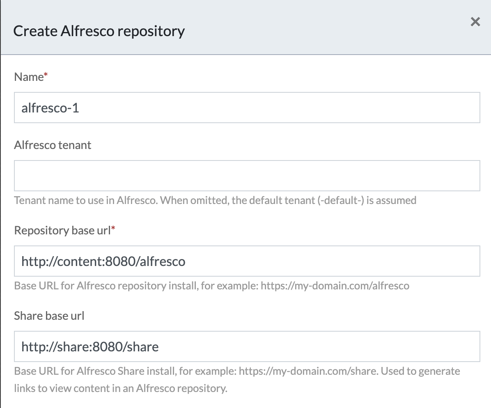

# APS Configuration for ADW Process Service in ADP

*I was trying to figure out how to get more acronyms in the title. :wink:*

In ADP 23.2.1 and greater, to use the Process Service (APS) from ADW, requires deploying [keycloak](https://www.keycloak.org/) (soon to be previously known as Alfresco Identity Service) into your instance. ADP does **most** of the heavy lifting to update files as necessary. What it doesn't do is configure the Alfresco Repository in APS. We've been used to the manual configuration, but before ADP started using AWS Route 53 for a DNS name that doesn't change, we would use the docker network for the Alfresco and Share base url's.



The steps below detail how to configure APS for use with ADW and Keycloak.

## Process

1. If you haven't already, deploy Identity Services into your instance.

    ```sh
    ./adp.py deploy identity
    ```

1. Once deployment completes, edit the file `data/services/process/activiti-identity-service.properties`. ADP will have uncommented all the `keycloak.*` entries.
1. Add the following additional line and save the change.

    ```properties
    alfresco.content.sso.redirect_uri=http://${dynamic.host}/activiti-app/app/rest/integration/sso/confirm-auth-request
    ```

   *The default value of that property tries to hit `http://localhost:9999` which won't work here.*
1. Restart `process` to pick up the change.

    ```sh
    ./adp.py restart process
    ```

1. Open the APS application. Then proceed to 'Identity management' and Tenants.
1. In the 'Alfresco Repositories' section add or edit the `alfresco-1` entry.

    

1. Set the repository and share urls with your instance's `dnsName` URL. Make sure the 'Identity Service authentication' radio button is selected. Finally, click Save.

    
1. Still in 'Identity management' go back to the 'Personal' tab. Scroll to the bottom 'Alfresco Repositories' section and click on the alfresco-1.

    
1. This will popup a window to authorize the 'demo' account.

    
1. You should see a window popup momentarily and then close. The icon for the Alfresco Repository should change to a check mark.

    
1. To be on the safe side, restart the ADP.

    ```sh
    ./adp.py stop ; ./adp.py start
    ```

That should do it. Then deployment for Identity Services handles enabling the APS part of ADW in the `digital-workspace` services `app.config.json` by setting the `processService` setting to `true`.

```json
    "plugins":{
        "aosPlugin": true,
        "contentService": true,
        "folderRules": true,
        "microsoftOnline": false,
        "processService": true,
        "tagsEnabled": true,
        "categoriesEnabled": true
    },
```

## References

1. [APS Documentation](https://docs.alfresco.com/process-services/latest/config/content/#content-services)