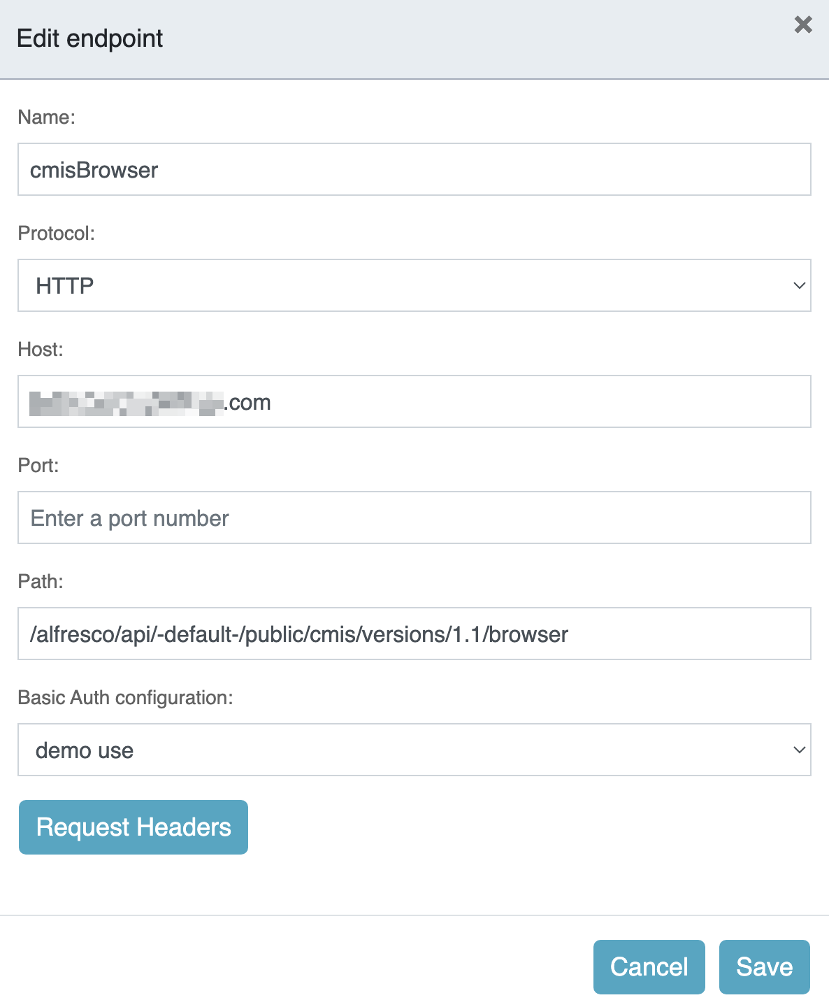
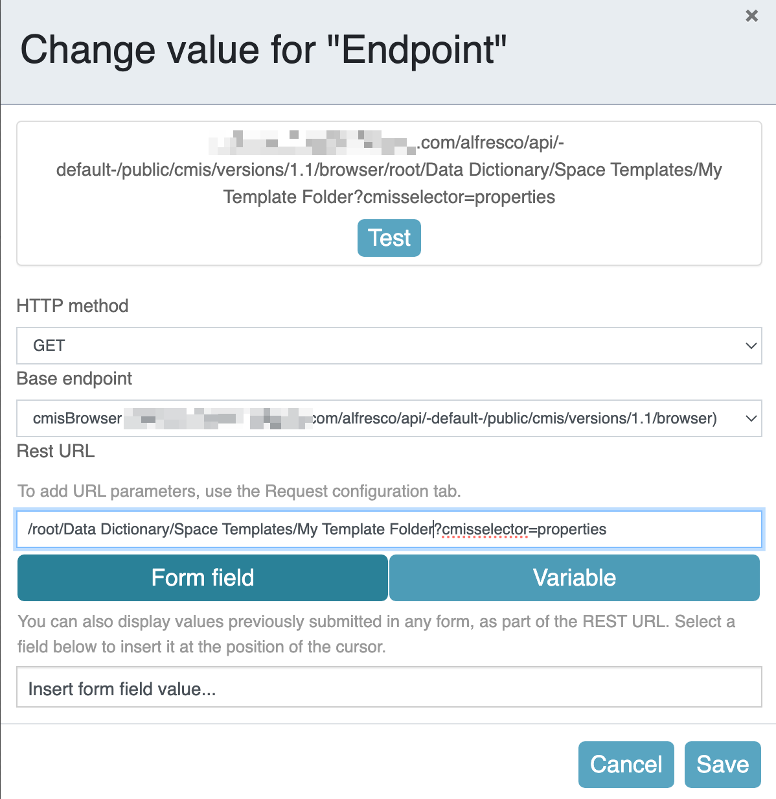
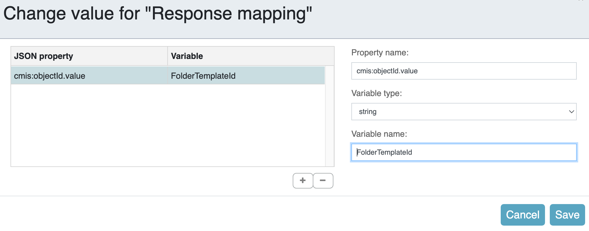
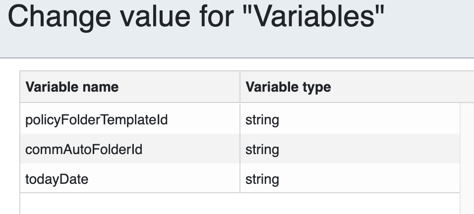
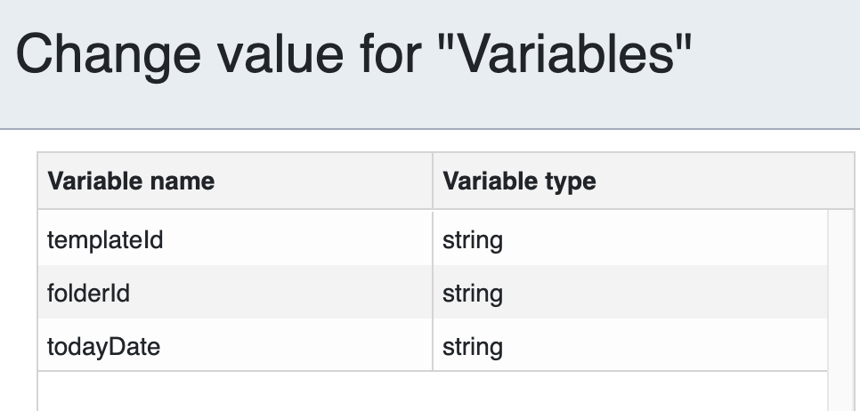
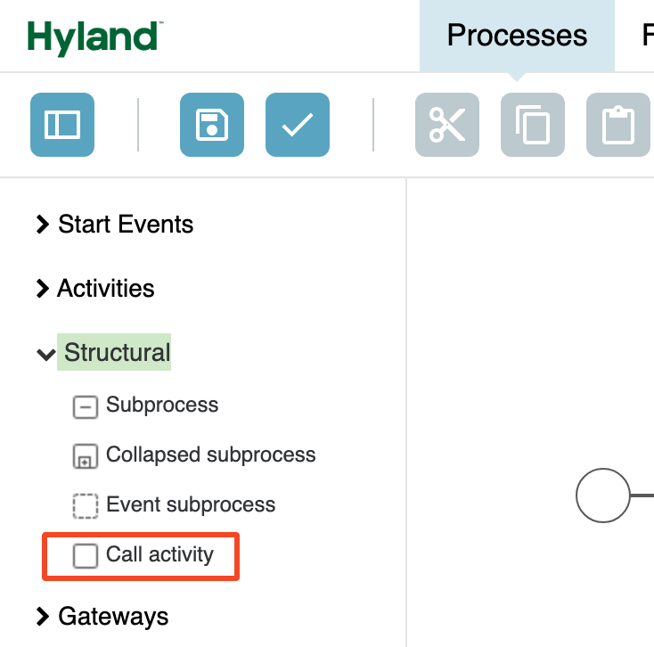
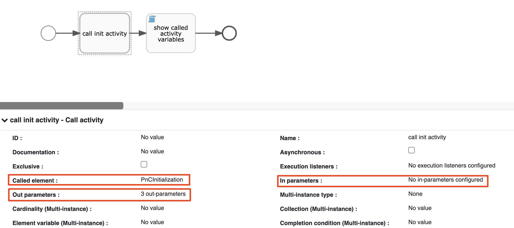
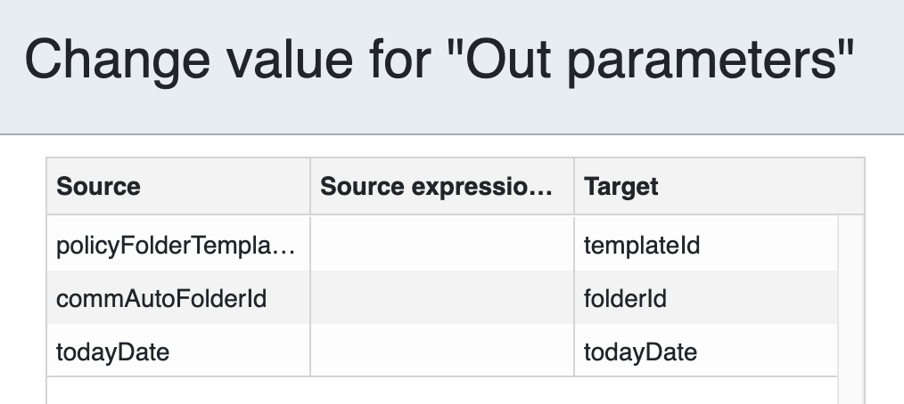

# APS Reusable, Dynamic Process Variable Initialization

This guide is for those of us who have a series of process models we've built that have
dependencies on the underlying Content Services repository. It could be destination folders for content, space templates, or whatever. The down and dirty method when initially developing is to create process variables with the node IDs of the important items. When we move them to a different system, we have to remember all the places we've hardcoded items and update. Wouldn't it be nice if we didn't need to do that anymore?

To remove all those manual changes, we make use of two concepts.

1. Querying the system for important node IDs rather than hard coding.
1. Utilize the APS **call activity** to allow all the dynamic initialization to be done in a single location which can be invoked by all process models that need access to the information.

As always, there's also likely a need for a javascript task to capture other fields and store them in process variables (process user, id, date, etc.).

## Query ACS for an item in a known location

There are multiple REST API endpoints available to do this. Each has it's own nuances and types of additional information it requires or will return. Below are two sample methods when the specific location is known; like the Data Dictionary or a location in a Site.

### CMIS browser query

Alfresco Content Services provides support for [CMIS - Content Managment Interoperability Services](https://www.oasis-open.org/standard/cmisv1-1/), an open standard allowing information to be shared between different content management system. To explore the larger capabilities of CMIS for Alfresco take a look at the [OpenCMIS](../../OpenCMIS/) page.
The following example uses the CMIS browser endpoint to return the node ID for a *Space Template* in the *Data Dictionary* named `My Template Folder`.

The base URL endpoint for the CMIS browser in an Alfresco Repository will be

```url
http[s]://ACS URL/alfresco/api/-default-/public/cmis/versions/1.1/browser
```

1. Create a corresponding End Point in APS.

    

1. Create an new Process Model in APS for your initialization Steps.
1. Create process variables for each value you are going to need (folder IDs, dates, email addresses, etc.).
1. Create a GET REST call task in the process.
    1. Use the endpoint created above for the CMIS browser as the base endpoint.
    1. To the Rest URL provide:
        1. The path to the template, starting with `/root`. So in this case

            `/root/Data Dictionary/Space Templates/My Template Folder`.
        1. Add the parameter `cmisselector`, set to **properties**.            *The default cmisselector for folders is* children *which returns the folder contents.*

           `?cmisselector=properties`

             

    1. Set the Response Mapping as

        

### CMIS query via ACS Search REST API

It is possible to do CMIS searches via the ACS Search API endpoint. While this version can more economical in the amount of information returned, the syntax of setting up a query we know should only return a single item is a little more involved. So in this particular use case I will only show the API URL and Body and assume you can map that into the APS REST call task if you really want to.

Here, we're after a folder in the site `argumentum-pnc`. The folder path in the site is `PnC Policy/Commercial Auto`.

The Base URL for the ACS Query REST API will be:

`http[s]://ACS URL/alfresco/api/-default-/public/search/versions/1/search`

The Request Body JSON will look similar to the following. *NOTE:* the spaces in the folder path need to be encoded within the JSON field values as `_x0020`. We are only returning the name and id properties.

```json
{
  "query": {
    "query": "select * from cmis:folder WHERE CONTAINS('PATH:\"//app:company_home/st:sites/cm:argumentum-pnc/cm:documentLibrary/cm:PnC_x0020_Policy/cm:Commercial_x0020_Auto\" ')",
    "language": "cmis"
  },
    "fields": ["id","name"]
}
```

The response you'll need to parse in the APS response mapping looks like:

```json
{
    "list": {
        "pagination": {
            "count": 1,
            "hasMoreItems": false,
            "totalItems": 1,
            "skipCount": 0,
            "maxItems": 100
        },
        "context": {
            "consistency": {
                "lastTxId": 743
            }
        },
        "entries": [
            {
                "entry": {
                    "name": "Commercial Auto",
                    "id": "9ea18488-21b4-4cc0-a184-8821b40cc0a7"
                }
            }
        ]
    }
}
```

## Utilize the APS call activity

The call activity differs from a subprocess in APS in that you can define process variable mappings both into and out of the activity. In this use case example, the *initialization* process we want to call sets three process variables internally.



The `policyFolderTemplateId` and `commAutoFolderId` values are queried via the CMIS browser calls detailed above. The `todayDate` variable is set via a javascript task.

Now, in any related process definition where you need those values, you can use the call activity and map the variables on output into ones defined in your process.

1. Create three process variables. In this case they're called `templateId`, `folderId`, and `todayDate`.

    

1. Drag a Call activity task onto the canvas.

    

1. There are three properties to focus on in the call activity.

    

    1. **Called element** - the is the **ID** (not the name) of the initialization process to call.
    1. **In parameters** - variables to map for the current process into the call activity. *In this case we don't need to pass variables to the call activity.*
    1. **Out parameters** - variables or expressions to map from the call activity into the current process.

        

        The source and target fields are variable names. The Source expression allows you to use variables from the call activity and operations to make changes to the value to store in the target variable.

*NOTE:* There aren't dropdown lists to select the variable names from, so you'll need to manually enter them and remember, **variable names are case-sensitive.**
