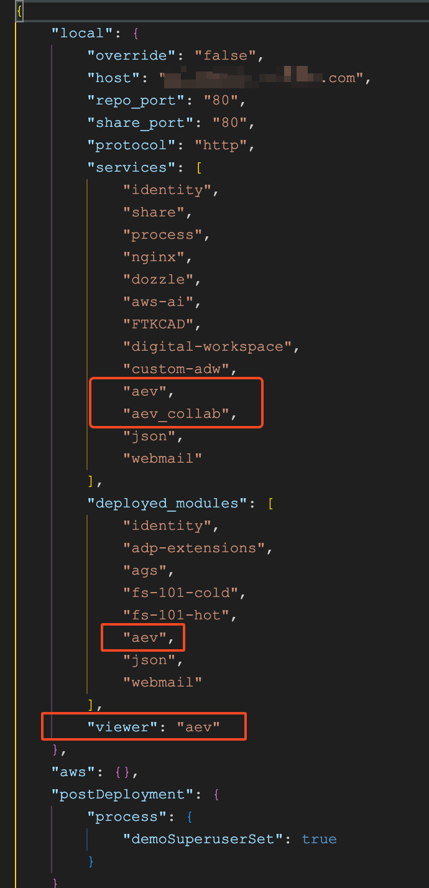

# Remove AEV from an ADP instance

The Alfresco Enterprise Viewer (AEV) access from ACS utilizes a couple of extension files deployed to the `content` and `share` containers in addition to running in its own `aev` and `aev_collab` containers. The procedure is similar to the [Remove a Custom Extension JAR or AMP from ADP](./ADP-Tips-Tricks/Undeploy%20Custom%20Extension/) process, but with a few more steps to deal with to clean up the ADP configuration.

## Procedure

You'll need a command line on your instance to issue `./adp.py` directives. *The file names below are those used in ADP 23.2.1 and may vary for older version.*

1. Stop ADP.
    ```sh
    ./adp.py stop
    ```
1. Remove the AEV extension files from the `content` service `custom` directory.
    ```sh
    rm data/services/content/custom/tsgrp-opencontent-4.0.0-for-acs23.amp
    rm data/services/content/custom/oa-alfresco.amp
    ```
1. Remove the AEV extension files from the `share` service `custom` directory.
    ```sh
    rm data/services/content/custom/oa-share-external-launcher.amp
    rm data/services/content/custom/oa-share-webpreview.amp
    ```
1. Edit the `config.json` to remove the aev references.
    * Remove `aev` and `aev_collab` from the `services` section.
    * Remove `aev` from the `deployed_modules` section.
    * Remove the entire `viewer` section.

    </img>
1. Destroy the AEV containers.
    ```sh
    ./adp.py destroy aev
    ./adp.py destroy aev_collab
    ```
1. Destroy the `content` and `share` containers with `-c` to retain other extensions.
    ```sh
    ./adp.py destroy content -c
    ./adp.py destroy share -c
    ```
1. Restart ADP
    ```sh
    ./adp.py start
    ```
