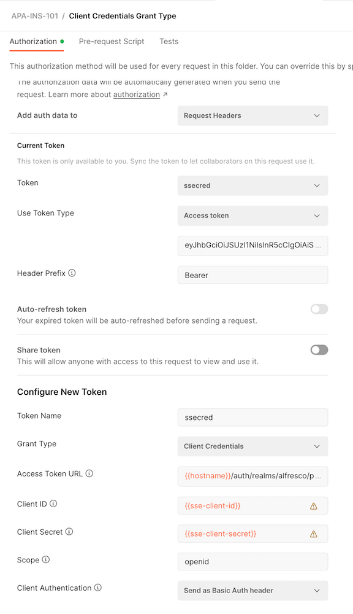
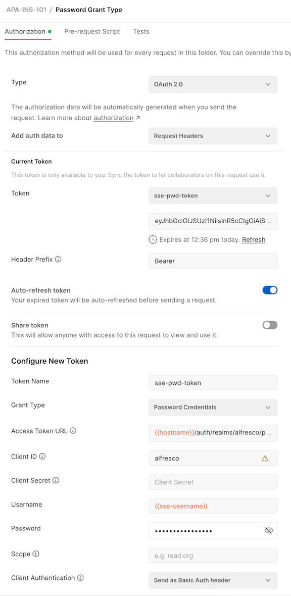

# Using Postman with Alfresco Process Automation REST API

To access the Swagger API explorers, you will need the name of your deployed application. From the [documentation](https://docs.alfresco.com/process-automation/latest/develop/#rest-api), the two primary endpoints are outlined in the Swagger UI's below.

- Application runtime bundle: `{domain-name}/{application-name}/rb/swagger-ui/index.html`
- Application query service: `{domain-name}//{application-name}/query/swagger-ui/index.html`

The two JSON files in this project are the Postman Environment File with the various variables used in the APA-INS-101 Postman Collection. These were designed using the Hyland SSE Alfresco Cloud PaaS instance, but the general concepts would apply to any Alfresco Cloud PaaS APA deployment.

## Authentication to APA

The Collection contains two folders with different authentication methods. Both require the Alfresco Cloud Support team to create a Client ID and a Client Secret. You can also use the se-team-sse-apa Client ID, but will need to have the Alfresco Cloud team associate the Client ID with roles in your appilcation. The requests in each folder inherit their authorizations from their containing folder.

- The Client Credentials Grant Type folder's Authentication section sets up an OAuth 2.0 Client Credentials token. This method could be used to demonstrate a service account interacting with APA. **This token doesn't auto refresh, and has a short validity window.**



- The Password Grant Type folder makes a keycloak request for a token for a specific user defined to APA. The request uses the default Alfresco PaaS Client ID of `alfresco` with no password, but also requires the user name and password. **This token will autorefresh (a postman feature) if it expires.**



Even though both folders have authorization configured at the folder level, they contain a `Get keycloak token` POST request that mimics the folder authorization settings to see *under the covers* for what Postman is doing to authenticate. When run, it sets environment variables with the access token and supplemental id and refresh tokens, as appropriate. You can inspect the tokens with JWT.IO.

You'll also notice the requests are pretty much the same in the two folders and there is a reason for that. The results for the GET's may differ, by design, based on the call and access token type. For example, a service account isn't likely to have a task assigned, so the Runtime Bundle GET task calls wouldn't return any tasks whereas authenticating as the assigned user would return the assocaited tasks.

As a general rule, the service account would use the query and query admin service calls and filter for the desired user. A user authenticated call would likely use the Runtime Bundle service.

## Decoding Access Tokens

The site [JWT.IO](https://jwt.io/) is a useful site to bookmark when working with access tokens. Use it to decrypt the tokens to it's native JSON. The section of the JSON to review to confirm access levels / roles in APA is the `resource-access` list. For example, the service account authentication token has the `ACTIVITI_USER` and `ACTIVITI_ADMIN` roles for the applications `ins-101` and `gp-ins-101`.

```JSON
  },
  "resource_access": {
    "gp-ins-101": {
      "roles": [
        "ACTIVITI_USER",
        "ACTIVITI_ADMIN"
      ]
    },
    "realm-management": {
      "roles": [
        "view-users",
        "view-clients",
        "query-clients",
        "query-groups",
        "query-users"
      ]
    },
    "account": {
      "roles": [
        "manage-account",
        "manage-account-links",
        "view-profile"
      ]
    },
    "ins-101": {
      "roles": [
        "ACTIVITI_ADMIN",
        "ACTIVITI_USER"
      ]
    }
  },
  "scope": "openid email profile",
```

## References

1. [Alfreso Process Automation Documentation](https://docs.alfresco.com/process-automation/latest/develop/#rest-api)
1. Hyland's Open Source Low Code Alfresco SharePoint site for credential and site information for the Postman Environment
1. [JWT.IO](https://jwt.io/) to decrypt JSON Web Tokens
