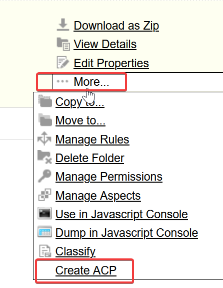
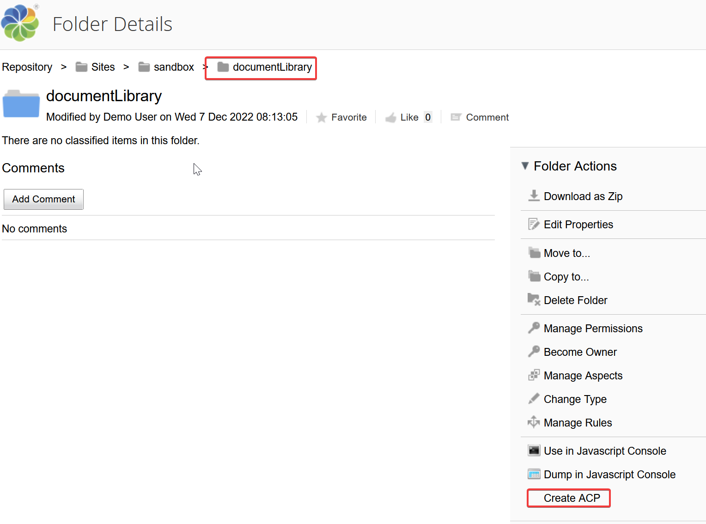
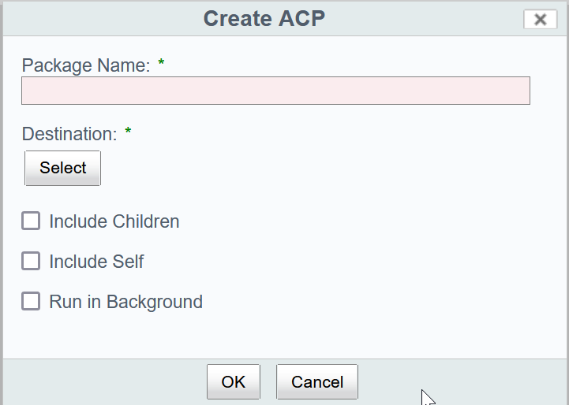
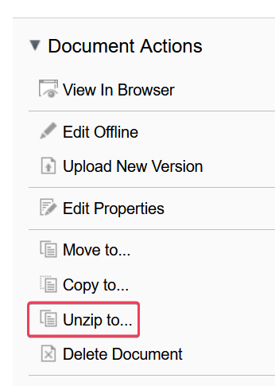
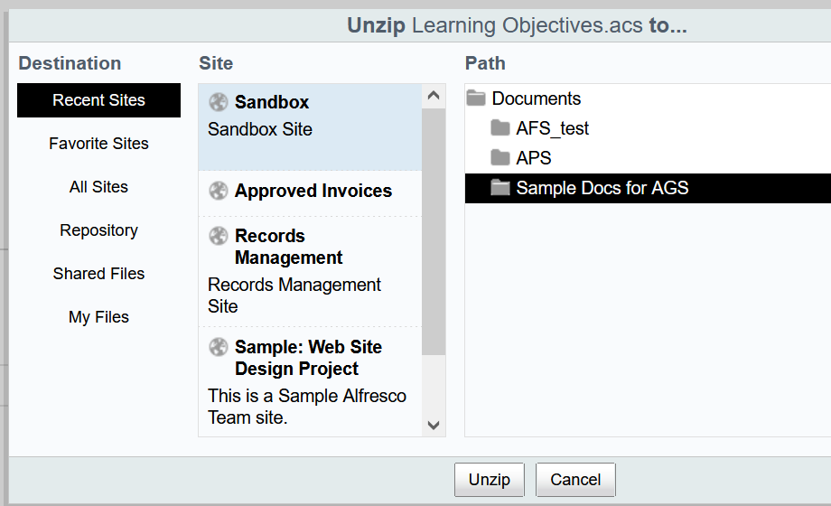

# Alfresco Content Package (ACP) Files

Alfresco Content Package (ACP) files are a mechanism to copy portions of an Alfresco Content Services (ACS) Respository (from single nodes to entire directory structures) to a different location in the same ACS instance or into a different ACS repository instance. The ACP file contains node information for each content node as well as folder rules.


An ACP file itself is a .zip file which contains

- an XML file containing all the metadata for each object in the ACP.
- a subdirectory containing the content elements associated with each object in the ACP.


## Creating an ACP File
The functionality for creating ACP files is native to Alfresco Content Services. There are three ways to access the functionality.

1. Via the Share UI.
1. Using the native REST API's action-definitions/export

    https://api-explorer.alfresco.com/api-explorer/#/actions

1. Using the JavaScript API.

    See the `actions` object's 'export' action.

 Each of these methods will create the ACP file at a specified location **in the source ACS system.** **Make sure to be aware of any dependencies for objects you are exporting!


>  
> :warning: **Warning:** The Generated Smart Folders are **NOT** ACP friendly.  
>
> *Be careful to exclude the generated folders. The base folder, with the System or Custom Smart Folder aspect is fine. If you include the generated folders, the export process dutifully captures and includes them **and their 'content'** in the ACP file. When they are imported, they retain the smart folder icon, so they appear to be smart folders. However, they are actual folders and will contain any content the source showed via the smart folder query!*


> :bulb: **Tip:**   
> To only export portions of a folder's contents, make a temporary folder and copy the desired contents to it. Then create the ACP file from the temp folder and likely *not* choosing the 'Include Self' option. For example, to only export certain scripts or templates from the Data Dictionary, copy them to a temporary folder. The create the ACP of just the temp folder's contents. When you import the ACP file back, simply point the import action the the proper Folder in the Data Dictionary.

<br/>

### Export Usage Information and Parameters
| `name` | `type` | `mandatory` | `multiValued` |
|--------|--------|:-----------:|:-------------:|
|`package-name`|`d:text`|true|false|
|`encoding`|`d:text`|true|false|
|`store`|`d:text`|true|false|
|`destination`|`d:noderef`|true|false|
|`include-children`|`d:boolean`|false|false|
|`include-self`|`d:boolean`|false|false|  

<br/>
   

*Or, from the Core REST API using a HTTP GET on /action-definitions/export*
```json
{
  "entry": {
    "applicableTypes": [],
    "parameterDefinitions": [
      {
        "name": "package-name",
        "type": "d:text",
        "multiValued": false,
        "mandatory": true
      },
      {
        "name": "encoding",
        "type": "d:text",
        "multiValued": false,
        "mandatory": true
      },
      {
        "name": "store",
        "type": "d:text",
        "multiValued": false,
        "mandatory": true
      },
      {
        "name": "destination",
        "type": "d:noderef",
        "multiValued": false,
        "mandatory": true
      },
      {
        "name": "include-children",
        "type": "d:boolean",
        "multiValued": false,
        "mandatory": false
      },
      {
        "name": "include-self",
        "type": "d:boolean",
        "multiValued": false,
        "mandatory": false
      }
    ],
    "name": "export",
    "trackStatus": false,
    "description": "Exports a Space and optionally its children to an Alfresco export package.",
    "adhocPropertiesAllowed": false,
    "id": "export",
    "title": "Export Space"
  }
}
```

### Create via Share

When using Share you must initiate the export (ACP file creation) on a folder node. Navigate to the folder's parent and either click the item detail field and from the item options select More... | Create ACP or from the Folder Details Screen.

</img> &nbsp;&nbsp;&nbsp;&nbsp;&nbsp;&nbsp;&nbsp;&nbsp;&nbsp;&nbsp;&nbsp;OR &nbsp;&nbsp;&nbsp;&nbsp;&nbsp;&nbsp;&nbsp;&nbsp;&nbsp;&nbsp;&nbsp; 
</img>

Complete the form and click 'OK'

</img>

<br />


### Create via REST API

See https://api-explorer.alfresco.com/api-explorer/#/actions/actionExec for detailed usage information.

Perform a POST to the endpoint *http[s]://BaseURL*/alfresco/api/-default-/public/alfresco/versions/1/action-executions using the following as a template


```json
{
  "actionDefinitionId": "export",
  "targetId": "d:noderef",
  "params": {
    "package-name": "myExport.acp",
    "encoding": "UTF-8",
    "store": "workspace://SpacesStore",
    "destination": "d:noderef",
    "include-self": "true or false",
    "include-children": "true or false"
  }
}
```

### Create via JavaScript API
Compose a Web Script controller script to execute from the Share JavaScript console. As refererence use https://docs.alfresco.com/content-services/latest/develop/repo-ext-points/javascript-root-objects/ and https://docs.alfresco.com/content-services/latest/develop/repo-ext-points/web-scripts/.

Use the following example as a template. When run it will create the ACP file in the demo user's home. It will contain all the folder information and content of the 'Account Docs' folder and its children and will include the Acccont Docs folder itself. It will capture an properties, aspects, and rules associate with the affected nodes.

```javascript
var nodeDestination =  companyhome.childByNamePath("User Homes/demo");
var exportAction= actions.create("export");  
exportAction.parameters['store'] = "workspace://SpacesStore";  
exportAction.parameters['destination'] = nodeDestination;  
exportAction.parameters['encoding'] = "UTF-8";  

var nodeToExport = companyhome.childByNamePath("Sites/sandbox/documentLibrary/Account Docs");
exportAction.parameters['package-name'] = "AccountDocs.acp";    
exportAction.parameters['include-self'] = true;  
exportAction.parameters['include-children'] = true;  
exportAction.execute(nodeToExport); 
```
  
## Import Content from an ACP File

Just like export / create, you can use the Share UI, the REST API, or the JavaScript API to import the contents of an ACP file. Obviously, the ACP file must be loaded to the destination system prior to processing.

> :memo: **Note:** As a best practice, make sure any content models or system dependencies exist on the destination ACS system, prior to importing the ACP file.

### Export Usage Information and Parameters

| `name` | `type` | `mandatory` | `multiValued` |
|--------|--------|:-----------:|:-------------:|
|`encoding`|`d:text`|false|false|
|`destination`|`d:noderef`|true|false|

<br/>
   

*Or, from the Core REST API using a HTTP GET on /action-definitions/import*
```json
{
  "entry": {
    "applicableTypes": [],
    "parameterDefinitions": [
      {
        "name": "destination",
        "type": "d:noderef",
        "multiValued": false,
        "mandatory": true,
        "displayLabel": "Destination"
      },
      {
        "name": "encoding",
        "type": "d:text",
        "multiValued": false,
        "mandatory": false,
        "displayLabel": "Encoding"
      }
    ],
    "name": "import",
    "trackStatus": false,
    "description": "Imports an Alfresco content package into the repository.",
    "adhocPropertiesAllowed": false,
    "id": "import",
    "title": "Import"
  }
}
```


### Import via Share

The Share UI has the built in capability to expand both ZIP files and ACP files. 

1. Upload the ACP file to the destination system, if necessary.
1. Open the document.
1. Select Unzip to... from Document Actions  
  </img>

1. Navigate to the target location and Unzip.  
  </img>

### Import via REST API

See https://api-explorer.alfresco.com/api-explorer/#/actions/actionExec for detailed usage information.

Perform a POST to the endpoint *http[s]://BaseURL*/alfresco/api/-default-/public/alfresco/versions/1/action-executions using the following as a template


```json
{
  "actionDefinitionId": "export",
  "targetId": "d:noderef",
  "params": {
    "encoding": "UTF-8",
    "destination": "d:noderef"
  }
}
```

### Import via JavaScript API

Compose a Web Script controller script to execute from the Share JavaScript console. As refererence use https://docs.alfresco.com/content-services/latest/develop/repo-ext-points/javascript-root-objects/ and https://docs.alfresco.com/content-services/latest/develop/repo-ext-points/web-scripts/.

Use the following example as a template. When run it will create the ACP file in the demo user's home. It will contain all the folder information and content of the 'Account Docs' folder and its children and will include the Acccont Docs folder itself. It will capture an properties, aspects, and rules associate with the affected nodes.

```javascript
var importAction = actions.create("import");  
importAction.parameters.encoding = "UTF-8";  
targetNodeForImport = companyhome.childByNamePath("Sites/sandbox/documentLibrary");  
importAction.parameters.destination = targetNodeForImport;  
ACPFile = companyhome.childByNamePath("User Homes/demo/AccountDocs.acp");  
importAction.execute(ACPFile);
```
