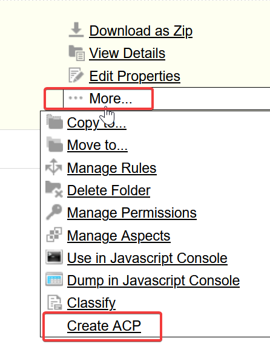
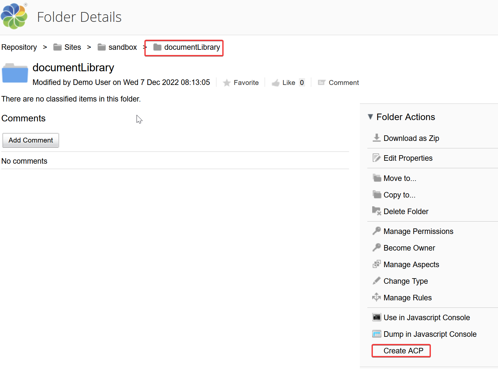
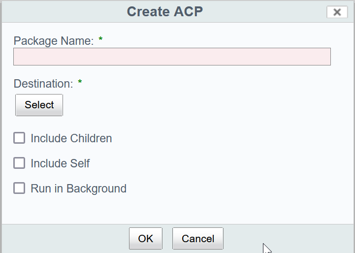

# Alfresco Content Package (ACP) Files

Alfresco Content Package (ACP) files are a mechanism to copy portions of an Alfresco Content Services (ACS) Respository (from single nodes to entire directory structures) to a different location in the same ACS instance or into a different ACS repository instance. The ACP file contains node information for each content node as well as folder rules.

An ACP file itself is a .zip file which contains

- an XML file containing all the metadata for each object in the ACP.
- a subdirectory containing the content elements associated with each object in the ACP.

## Creating an ACP File
The functionality for creating ACP files is native to Alfresco Content Services. There are three ways to access the functionality.

1. Via the Share UI.
1. Using the native REST API's action-definitions/export

    https://api-explorer.alfresco.com/api-explorer/#/actions

1. Using the JavaScript API.

    See the `actions` object's 'export' action.

 Each of these methods will create the ACP file at a specified location in the source ACS system.


>  
> :warning: **Warning:** The Generated Smart Folders are **NOT** ACP friendly.  
>
> *Be careful to exclude the generated folders. The base folder, with the System or Custom Smart Folder aspect is fine. If you include the generated folders, the export process dutifully captures and includes them **and their 'content'** in the ACP file. When they are imported, they retain the smart folder icon, so they appear to be smart folders. However, they are actual folders and will contain any content the source showed via the smart folder query!*

### Usage Information and Parameters
| `name` | `type` | `mandatory` | `multiValued` |
|--------|--------|:-----------:|:-------------:|
|`package-name`|`d:text`|true|false|
|`encoding`|`d:text`|true|false|
|`store`|`d:text`|true|false|
|`destination`|`d:noderef`|true|false|
|`include-children`|`d:boolean`|false|false|
|`include-self`|`d:boolean`|false|false|  

<br/>
   

*Or, from the Core REST API using a HTTP GET on /action-definitions/export*
```json
{
  "entry": {
    "applicableTypes": [],
    "parameterDefinitions": [
      {
        "name": "package-name",
        "type": "d:text",
        "multiValued": false,
        "mandatory": true
      },
      {
        "name": "encoding",
        "type": "d:text",
        "multiValued": false,
        "mandatory": true
      },
      {
        "name": "store",
        "type": "d:text",
        "multiValued": false,
        "mandatory": true
      },
      {
        "name": "destination",
        "type": "d:noderef",
        "multiValued": false,
        "mandatory": true
      },
      {
        "name": "include-children",
        "type": "d:boolean",
        "multiValued": false,
        "mandatory": false
      },
      {
        "name": "include-self",
        "type": "d:boolean",
        "multiValued": false,
        "mandatory": false
      }
    ],
    "name": "export",
    "trackStatus": false,
    "description": "Exports a Space and optionally its children to an Alfresco export package.",
    "adhocPropertiesAllowed": false,
    "id": "export",
    "title": "Export Space"
  }
}
```

### Create via Share

When using Share you must initiate the export (ACP file creation) on a folder node. Navigate to the folder's parent and either click the item detail field and from the item options select More... | Create ACP or from the Folder Details Screen.

</img> &nbsp;&nbsp;&nbsp;&nbsp;&nbsp;&nbsp;&nbsp;&nbsp;&nbsp;&nbsp;&nbsp;OR &nbsp;&nbsp;&nbsp;&nbsp;&nbsp;&nbsp;&nbsp;&nbsp;&nbsp;&nbsp;&nbsp; 
</img>

Complete the form and click 'OK'

</img>

<br />

> :bulb: **Tip:**   
> To only export portions of a folder's contents, make a temporary folder and copy the desired contents to it. Then create the ACP file from the temp folder and likely *not* choosing the 'Include Self' option.


### Create via REST API

See http://grpalf.webhop.me/api-explorer/#/actions/actionExec

Invoke the endpoing http://grpalf.webhop.me/alfresco/api/-default-/public/alfresco/versions/1/action-executions with the 
```json
{
  "actionDefinitionId": "export",
  "targetId": "d:noderef",
  "params": {
    "package-name": "myExport.acp",
    "encoding": "UTF-8",
    "store": "workspace://SpacesStore",
    "destination": "d:noderef",
    "include-self": "true or false",
    "include-children": "true or false"
  }
}
```

### Create via JavaScript API

  

## Import Content from an ACP File