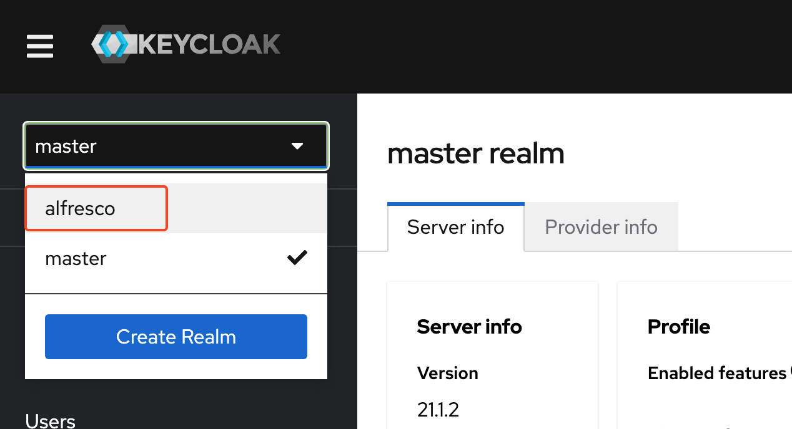
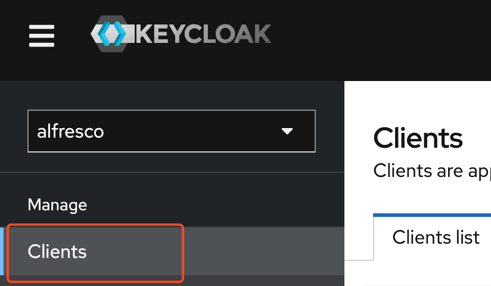
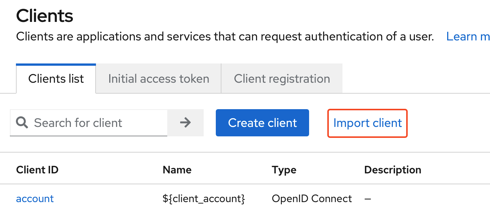
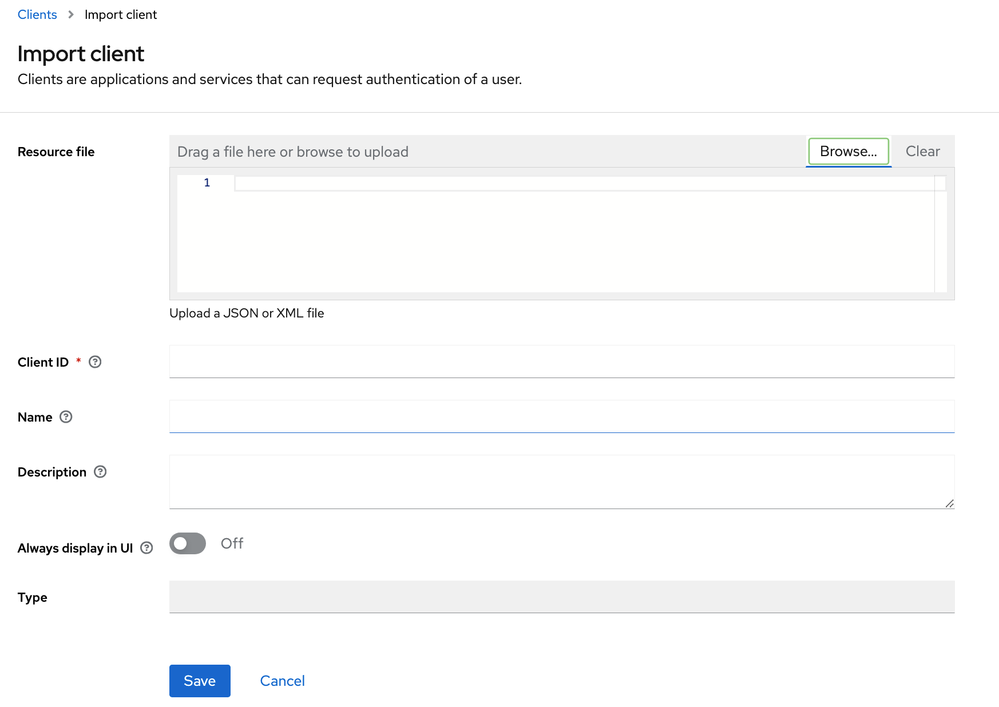
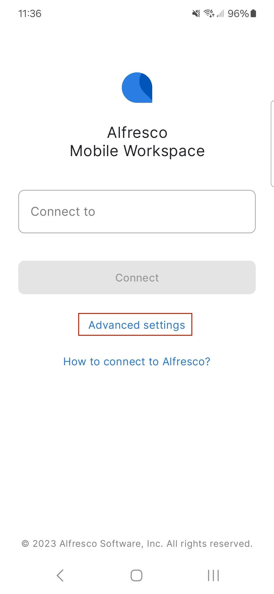
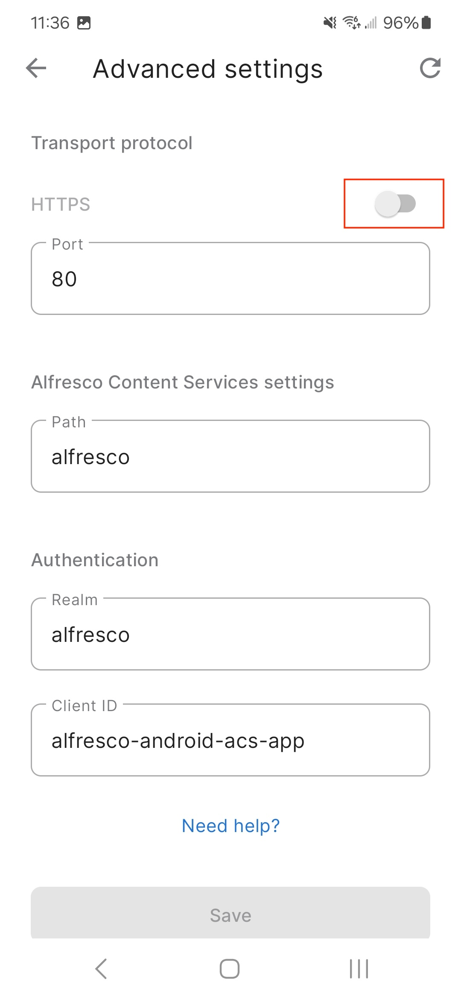

# Configure [Keycloak](https://www.keycloak.org/) for Alfresco Mobile Workspace

In you have deployed the identity service you need to make updates to ADP's default Keycloak configuration.

*This configuration has been tested against Alfresco Identity Services 2.0 (keycloak 21.1.2).*

## Prep Work

Download the client configuration files.
- [Android ACS](./assets/alfresco-android-acs-app.json)
- [Android APS](./assets/alfresco-android-aps-app.json)
- [iOS ACS](./assets/alfresco-ios-acs-app.json)
- [iOS APS](./assets/alfresco-ios-aps-app.json)
- [All four](./assets/Alfresco-MobileWorkspace-ClientConfigs.zip)

## Nuts and Bolts

1. Login to the Keycloak Admin tool `http://xxxxx.xxxx.com/auth/admin/`. The credentials are in the ADP documentation.
1. Select the Alfresco Realm. Then click on `Clients`

    

    

1. For each of the Client JSON File
    1. Click 'Import Client'

        
    1. Click 'Browse' and navigate to the JSON configuration file. Then click 'Save'.

        

The changes will be immediately available. No need to restart keycloak / the identity service container.

## Configure Mobile Workspace App

If you haven't enabled SSL on the instance or it's not using port 443 / 80, update the settings in the app accordingly.

1. Open the app on your phone / tablet. On the main screen select 'Advanced settings'.

    
2. Set the HTTPS toogle and port, if needed.

    

3. Enter just the host name or IP address in the 'Connect to' address. (leave off http/https)

# References

1. [Process Services](https://docs.alfresco.com/identity-service/latest/tutorial/sso/ldap/#step-9-optional-configure-a-mobile-client-for-process-services)
1. [Content Services](https://docs.alfresco.com/identity-service/latest/tutorial/sso/ldap/#step-10-optional-configure-a-client-for-content-services-for-ios)
