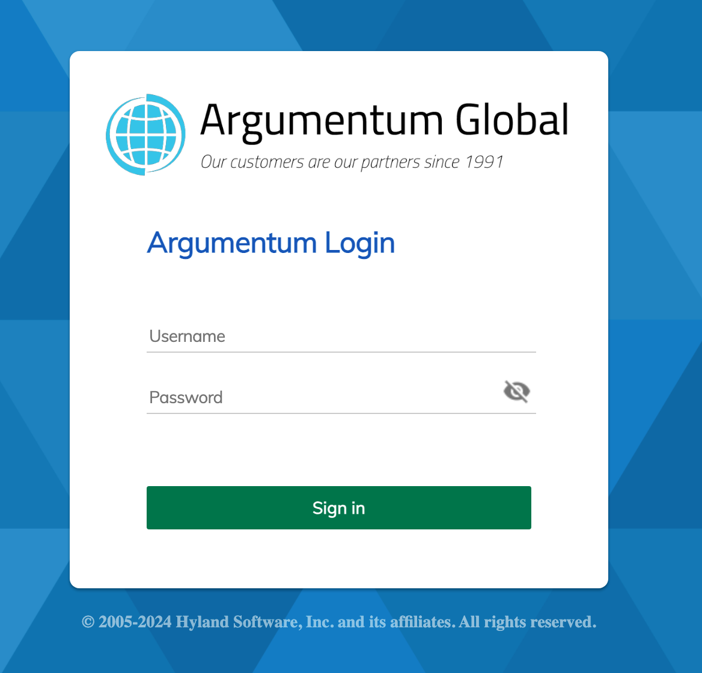

# Customize the Keycloak Login Screen

*[Keycloak](https://keycloak.org) provides a mechanism to theme your login screen. See the [official documentation](https://keycloak.org/docs/latest/server_development/#_themes) for complete instructions.*
The Alfresco Identity Services distribution and the Alfresco Demo Platform (ADP) distributions already provide a default **Alfresco** themed login. This guide uses that theme definition and simply adjusts the graphics for the desired customization.

## Process

Users of Alfresco and ADP recognize the default login when identity services is deployed.


By changing just two images and updating two [FreeMarker](https://freemarker.apache.org/) Template (`.ftl`) files we end up with this custom login.



The zip file [mytheme.zip](./assets/mytheme.zip) in this project has the framework you'll need. The expanded version is also here for reference.

1. Copy your logo and background image files into the `mytheme/login/resources/img` directory.
1. Edit the `mytheme/login/template.ftl` file. Change the background image file name highlighted with your background image file.
    

1. Edit the `mytheme/login/login.ftl` file. Change the logo image name and optionally the Application Name string as necessary.
    

1. Create a zip file of the entire `mytheme` directory structure.
    ```shell
    zip -r mytheme.zip ./mytheme
    ```

1. Copy the zip file into the keycloak directory structure. In ADP this is the identity container. A simple way is to copy the zip file into the `adp/import` directory.

1. Get a command line inside the identity container. From the `adp` directory
    ```shell
    docker-compose exec identity /bin/bash
    ```
1. Change directory to where keycloak is deployed and unzip your theme zip file.
    ```shell
    cd /opt/keycloak/themes
    unzip /data/import/mytheme.zip
    exit
    ```
1. Open the keycloak admin web page - http://your-alfresco-system/auth/ - and click Administration Console.

1. Login as admin. (Password for ADP is in the ADP documentation).

1. Select the `alfresco` realm.

    

1. Goto Realm settings | Theme | Login theme and choose your `mytheme` realm. Then save the changes.

    

1. Just to be thorough, restart the identity container.
    ```shell
    ./adp.py restart identity
    ```
Celebrate!