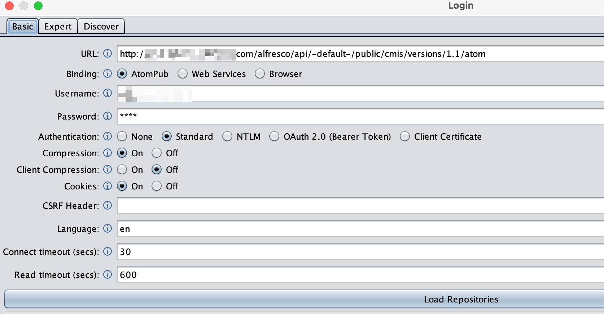
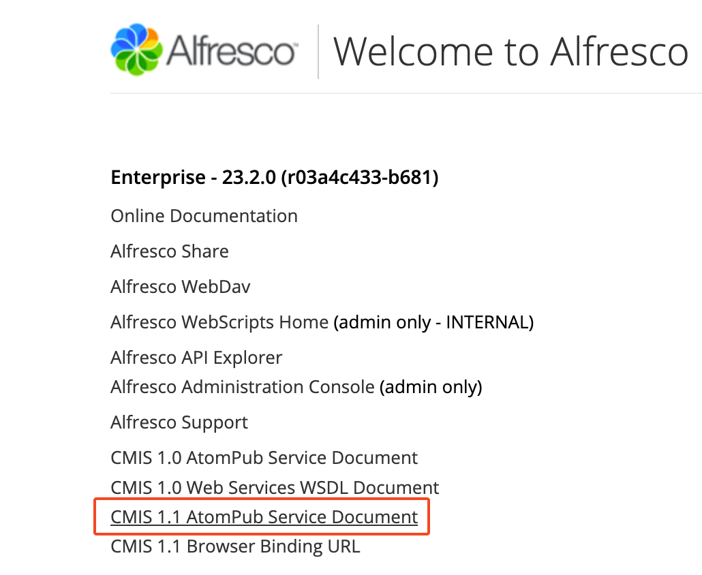
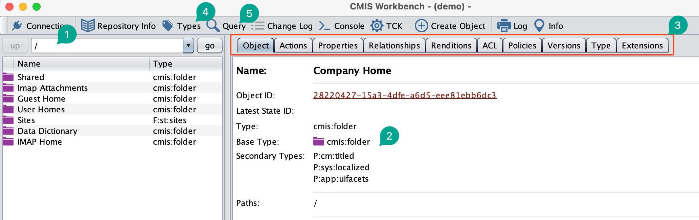

# Use Apache Chemistry OpenCMIS Workbench with Alfresco

CMIS (Content Management Interoperability Services) is a vendor-neutral OASIS Web services interface specification that enables interoperability between Enterprise Content Management (ECM) systems. CMIS allows rich information to be shared across Internet protocols in vendor-neutral formats, among document systems, publishers and repositories, in a single enterprise and between companies.

## Setup

To use the workbench, you will need java installed and available on your path.

Unzip [Apache Workbench](./assets/chemistry-opencmis-workbench-1.1.0-full.zip) on your workstation. See [Apache's Site](https://chemistry.apache.org/java/download.html) for other downloads and documentation.

Open a command prompt or terminal window as appropriate and change directory to the unzipped location. Run the appropriate `workbench.*` version for your OS.

* `./workbench.sh` for Mac / WSL / Linux
* `.\workbench.bat` for the Windows folks.

> :bulb: Windows users can create a shortcut. To create a 'shortcut' for Mac / Linux users add an alias to your `.zshrc` (Mac) or`.bashrc` (*nix) similar to \
> `alias cmis='cd ~/<unzipped directory>;./workbench.sh'` \
> The `.*shrc` files are in your login / home directory. (Either start a new terminal to pick up the new alias or run the command `source ~/.bashrc` or `source ~/.zshrc` to make it available in the current terminal.)

## Usage

Click the Connection button if needed and enter the URL for your Alfresco System.

The CMIS 1.1 atom endpoint is at `<alfresco url>/alfresco/api/-default-/public/cmis/versions/1.1/atom`

Click Load Repositories and then Login.

You can also find the CMIS connection URL at `<alfresco url>/alfresco`.

## Navigating

The main window drops you into `Company Home`.

1. The left pane allows you to navigate through the repository directory structure.
2. The object type is mapped is listed as the base type. The Alfresco Folder and Document types are mapped to CMIS as `cmis:folder` and `cmis:document`, respectively. Also, Alfresco ***Aspects*** are represented as ***Secondary Types***.
3. The right hand section will change based on the which tab (Balloon 3)
    - **Actions** vary based on the node type. With rights, you can change properties and security.
    - **Properties** show the system and user defined properties for the node and their types, values, and ID.
    - **Relationships** are the associations for the node.
    - **Type** will show the type definition for the node's type.
    - **Others** There is a ton of information availble in these tabs.
4. The **Types** button opens the type definitions for the repository in a new window. Aspect Definitions are under 'Secondary Type'. Folder types, both system and user defined, are under 'Folder'; the same for document types under 'Document'.
5. The **Query** button allows you to write, debug, run repository queries with CMIS sql. They way Alfresco maps from CMIS onto the repository is very powerful. It maps Types and Secondary Types as tables for query purposes and they can take place in JOINS. \
   - Query all folders with custom type `inspol:policyFolder` \
   `SELECT * FROM inspol:policyFolder`
   - Query Policy Folders with the Postal Address aspect `addr:postalAddress` \
   `SELECT * FROM inspol:policyFolder f INNER JOIN addr:postalAddress` a ON f.cmis:objectId = a.cmis:objectId`
  
## References

1. [Apache Chemistry Archive Site](https://chemistry.apache.org/java/developing/guide.html)
1. [Alfresco CMIS API Reference](https://docs.alfresco.com/content-services/latest/develop/reference/cmis-ref/)
1. [OASIS CMIS Documentation](https://docs.oasis-open.org/cmis/CMIS/v1.1/CMIS-v1.1.html)