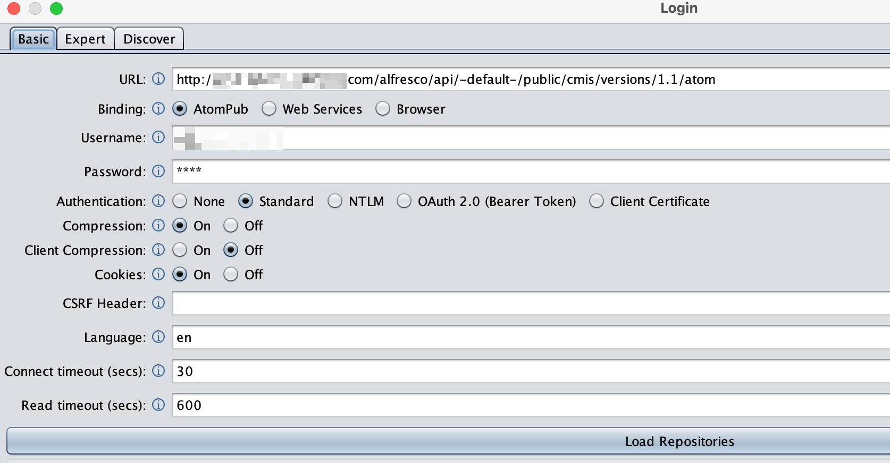

# Use Apache Chemistry OpenCMIS Workbench with Alfresco

Unzip [Apache Workbench](./chemistry-opencmis-workbench-1.1.0-full.zip) on your workstation.

See [Apache's Site](https://chemistry.apache.org/java/download.html) for other downloads and documentation.

Run the appropriate `workbench.*` version for your OS.

Click the Connection button if needed and enter the URL for your Alfresco System.

The CMIS 1.1 atom endpoint is at `<alfresco url>/alfresco/api/-default-/public/cmis/versions/1.1/atom`

Click Load Repositories and then Login.
