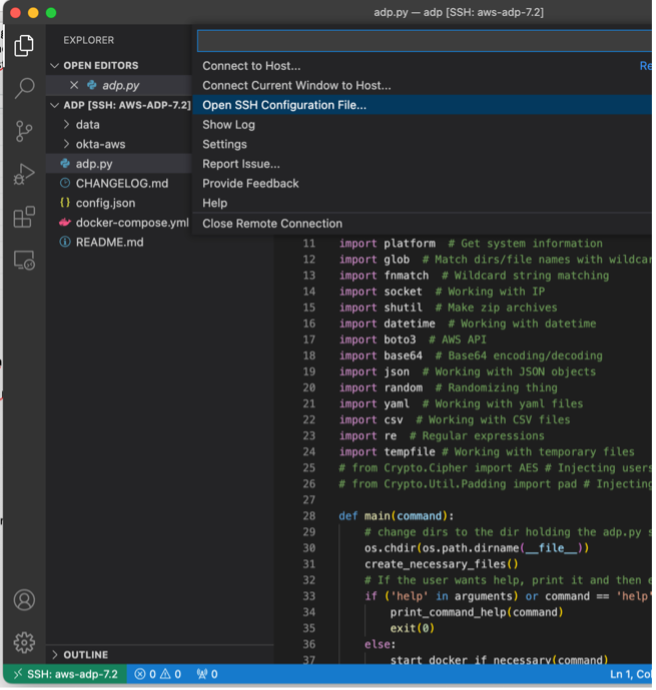
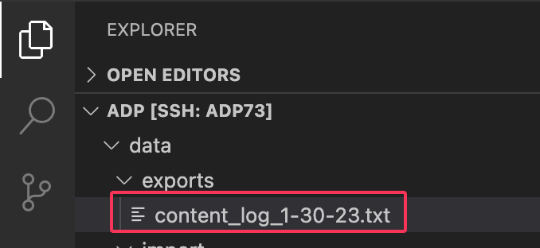

# Configure VS Code for Use with Remote SSH

*This document derived from [https://medium.com/@christyjacob4/using-vscode-remotely-on-an-ec2-instance-7822c4032cff](https://medium.com/@christyjacob4/using-vscode-remotely-on-an-ec2-instance-7822c4032cff).*

Microsoft has several VS Code extensions to facillitate access to remote machines running an ssh server. These extensions allow using the *local* VS Code application to view and edit files on the *remote* machine. On the initial connection, VS Code installs the files it needs on the remote machine.

## Setup

At a minimum, install the [Remote - SSH](https://marketplace.visualstudio.com/items?itemName=ms-vscode-remote.remote-ssh "Remote-SSH") extension from Microsoft. The extension requires having an OpenSSH client installed on your local machine.

There are two additional I find helpful, also from Microsoft. 

- Remote - SSH: Editing Configuration Files provide syntax highlighting when editing the SSH Configuration files.
- Remote Explorer adds another app to the VS Code side bar with all the configured remote hosts listed for easy selection.

## Configure A Remote Host

Click the green status bar item '><' in the lower left of the VSCode screen open SSH Configuration file.

Select your personal file under your login directory. On the Mac it will be in /Users/`<user-name>`/.ssh/config - also known as \~/.ssh/config.\*. The tilde (\~) is \*nix shorthand for your home directory.

Give the 'Host' portion an alias that you'll see when connecting from VS Code or from a command prompt. *Remember the VS Code extension is sitting on top of the standard OpenSSH application and configuration.*

Each
Host stanza looks like:

 Once complete, save the file. 

Since this is built on the standard ssh package, having the above stanza in the config file means from a command line,

`ssh aws-adp`

is functionally equivalent to

`ssh -i ~/aws-key/test-key.pem ec2-user@ec2-1-2-3-4.us-west-2.compute.amazonaws.com`

## Connect to a Remote Host

Click the status item and choose 'Connect to Host'. This will list all the hosts defined in your ssh config file. Select the desired remote host. VS Code will initiate the ssh connection and you are prompted for the remote directory to open. 

> :memo: **Note:** If this is the first connection, VS Code will install its server side components before prompting for the directory to open.

Once successfully, the ssh alias will appear in the lower left of the action status bar.

If you installed the Remote Explorer extension, you could also select the extension icon to see the list of hosts from your ssh config file. The nice thing about using this is it remembers the remote directory you opened.

## Summary and Benefits

Once successfully configured, you start and run VS Code on your local workstation to edit files on the remote server as if they were local.

### ADP Benefits

If you open a terminal window in VS Code from the Terminal menu or by pressing Ctrl-`, you have a shell on the remote host, not your local machine. Here you can enter your normal ./adp.py commands as if you'd ssh'd to the server from your workstation.

### Editing files ***INSIDE*** Containers!

Adding the Microsoft Docker plugin to VS Code provides the ability to edit files inside the containers as long Docker is installed. Search the Extentions Marketplace for 'Docker'. It is also available at this
[VS Marketplace Link.](https://marketplace.visualstudio.com/items?itemName=ms-azuretools.vscode-docker)

When the extension is enabled, you'll see the docker icon in the left action bar. Select it for access to container information and files.

For running containers, you'll be able to drill down under the container to view / edit files *INSIDE* the container.

Since ADP instances are build with Docker containers, enabling the Docker extension when connected to the remote system using the Remote - SSH extension **you can also view and edit files within the ADP containers!** 

Connect to your remote ADP instance and open the ADP folder. If necessary start ADP. Open the Extensions pane and search for Docker. You'll then have an option to install it to the remote instance.

Once successful, you'll see the docker emblem. Click on it and you'll see running containers. Expand one and you'll see Files. Drilling down in Files, you are traversing the container's directory tree. The icon highlighted below on a file will open it in the VS Code editor. The other is for download to the local EC2 filesystem.

### File Transfer Simplified

On the Mac, you can drag items from Finder (it should work from Window Explorer also) into the folder structure in VS Code to upload them. You can't move them into one of the containers this way, but it gets them to the remote server. It doesn't look like you can drag files from the remote VS Code directories back to Finder. However, you can right click and select download.

### Pro Tip for Working with ADP

*This isn't specific to the VS Code Remote SSH, but it's mighty useful since you now have a graphical IDE and an embedded terminal on the remote host.*

The adp/data directory is available as /data from most, if not all, of the containers. You can use the import or exports folder under data to make files accessible between the host server and the container.

and

When using these directories to access files between host server and container, you may run into permission issues. The owner and group attributes of the files will differ based on where you are looking at them (host or container). Those permissions may not always be conducive to simple file clean up. Luckily, from the host EC2 server, the ec2-user has the ability to use the sudo command (allow to run the single command with elevated privileges).

For example,

`sudo chmod ugo+rw <filenames>`

adds read/write for all users to the affected files.
